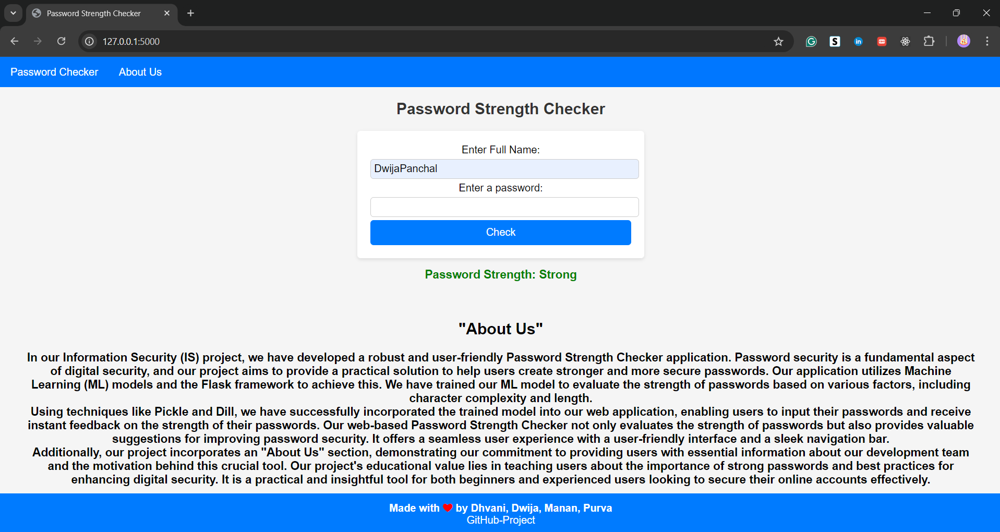

## 🛡️ Password Strength Checker

### 📜 Description

This project is a machine learning model that checks the strength of passwords using the **XGBoost** algorithm. It classifies passwords into three categories: **Weak**, **Moderate**, and **Strong** based on their complexity and security. You can use this model to evaluate the strength of passwords and enhance security for your applications.

### 📊 Dataset

The passwords used in our analysis come from the **000webhost leak** dataset available online, containing more than **6.6 million unique passwords**.

### ✨ Key Features

- **Data Preparation:** Loads and preprocesses password data from a CSV file (`data.csv`).
- **Feature Extraction:** Utilizes `TfidfVectorizer` to convert passwords into numerical features.
- **Model Training:** Applies the **XGBoost** algorithm to classify password strength.
- **Evaluation and Visualization:** Visualizes results using libraries like `matplotlib` and `seaborn`.

### 🛠️ Requirements

- Python 3.9 or higher
- Required libraries: `pandas`, `matplotlib`, `seaborn`, `scikit-learn`, `xgboost`, `dill`

### 🚀 Installation

To run this password strength checker on your local machine, follow these steps:

1. **Clone the Repository:**

   ```bash
   git clone https://github.com/your-username/pswd-strength-checker.git
   cd pswd-strength-checker
   ```

2. **Install Dependencies:**

   You can install all required libraries by running:

   ```bash
   pip install -r requirements.txt
   ```

3. **Run the Application:**

   To start the application, run:

   ```bash
   python app.py
   ```

### 📈 Usage

1. **Run the Notebook:**
   Open the Jupyter Notebook (`model.ipynb`) and run all cells to train the model and evaluate password strength.

2. **Visualize the Results:**
   The notebook includes plots and visualizations to interpret the model’s performance.

### 📁 Data

The data used for this project is loaded from a CSV file named `data.csv`. This file contains password samples with corresponding labels indicating their strength.

### 🌐 Snippets



##### It was developed as part of academic projects in the Information Security subject.

